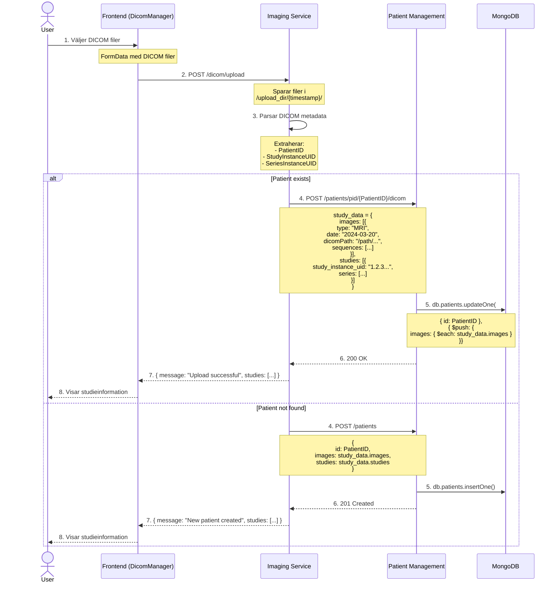
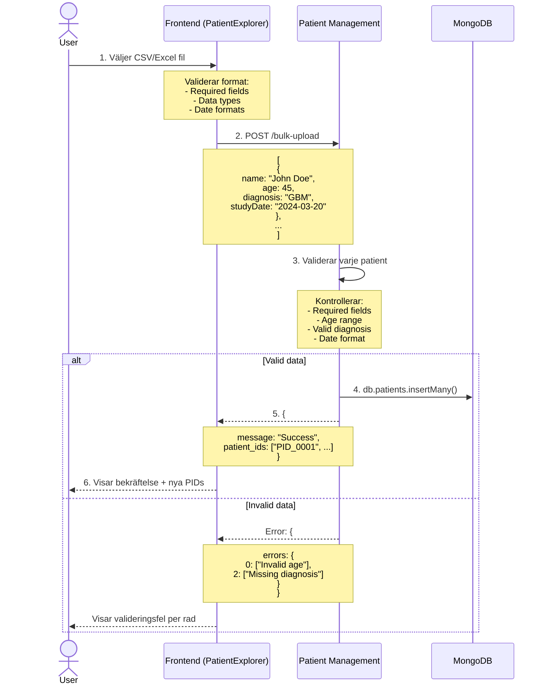

NEUROSURGERY PLATFORM
====================

TECHNICAL ARCHITECTURE

A comprehensive platform for neurosurgical planning, monitoring, and analysis.

CORE COMPONENTS

1. Frontend (React + TypeScript)
- Modern SPA architecture with real-time monitoring
- Key features:
  * Patient dashboard with vital metrics
  * Patient Explorer with advanced filtering and sorting
  * Real-time ICP monitoring with alerts
  * 3D tumor visualization using Three.js
  * Surgical approach planning interface
  * ICD coding assistance
- DICOM Management:
  * Advanced DICOM viewer with MPR support
  * Window/level presets and controls
  * Measurement tools (distance, angle, area)
  * DICOM import from folders and DICOMDIR
  * Series organization and metadata display
  * Real-time volume rendering
  * Debug and validation tools
- Shared Components:
  * PatientHeader: Consistent patient info display
  * ServiceStatus: Service health monitoring
  * CommonControls: Reusable UI controls
- Global State Management:
  * PatientContext: Patient data management
  * ServicesContext: Service status tracking
- Unified Styling:
  * Shared CSS components
  * Consistent theming
  * Responsive layouts
  * Styled-components integration
  * Global theme system with CSS variables
- Technologies: React 18, TypeScript, Chart.js, Three.js

2. Main API (Node.js + Express)
- Central orchestration layer
- Handles:
  * Patient data management
  * Authentication/Authorization
  * Request routing to microservices
  * Data aggregation
  * DICOM import coordination
- Technologies: Node.js, Express, TypeScript, Mongoose

3. Tumor Analysis Service (Flask)
- Specialized Python microservice for:
  * Tumor segmentation
  * Critical structure identification
  * Surgical approach risk analysis
  * MGMT methylation status prediction
  * Molecular marker analysis
- Technologies: Flask, TensorFlow, NumPy, PyDICOM

4. ICP Monitoring Service (Flask)
- Dedicated service for:
  * Real-time ICP trend analysis
  * ICP prediction and alerting
  * Risk factor analysis
- Technologies: Flask, TensorFlow, NumPy

5. Model Training Service (Flask)
- Dedicated service for:
  * Training tumor classification models
  * ICP prediction model training
  * Model versioning and storage
- Technologies: Flask, TensorFlow, Keras

6. Medical Documentation Service (Flask)
- Natural language processing for:
  * ICD-10 code suggestions
  * Procedure coding
  * Clinical text analysis
  * Journal generation
  * Voice transcription
  * Real-time audio transcription with WebRTC
  * Streaming journal generation
  * Interactive coding suggestions
- Technologies: Flask, Transformers, PyTorch, Whisper

7. Imaging Data Service (Flask)
- DICOM data management:
  * Folder-based DICOM import
  * DICOMDIR parsing
  * Study/Series organization
  * DICOM metadata extraction
  * Advanced search functionality
  * Image data organization
  * MPR (Multiplanar Reconstruction) support
  * Volume data extraction and processing
  * Window/level presets management
  * DICOM validation and debugging tools
  * Measurement calibration support
- Technologies: Flask, PyDICOM, PyMongo

9. Simulator Service (Flask)
- Neurosurgical simulation features:
  * Session management and tracking
  * Performance metrics collection
  * Crisis scenario management
  * Real-time vital sign monitoring
  * Procedure step tracking
  * Medication management
- Technologies: Flask, PyMongo

9. Data Storage
- MongoDB:
  * Patient metadata
  * Analysis results
  * Model metadata
  * System logs
  * DICOM metadata
- Local DICOM storage:
  * Raw imaging data
  * Segmentation masks
  * Analysis outputs

API ENDPOINTS

1. Patient Management Service (port 5004)
- /patients: Get all patients with filtering
- /patients/<id>: Get, update, delete single patient
- /patients/pid/<pid>: Get, update, delete single patient by PID
- /bulk-upload: Bulk patient data upload
- /health: Service health check

2. Tumor Analysis Service (port 5005)
- /api/analysis/tumor: Tumor analysis
- /api/analysis/mgmt/{study_id}: MGMT methylation status prediction

3. ICP Monitoring Service (port 5006)
- /api/analysis/icp/predict: ICP prediction

4. Training Service (port 5001)
- /api/training/tumor: Model training
- /api/training/icp: ICP model training

5. Clinical Coding (port 5002)
- /api/coding/icd: ICD code suggestions
- /api/coding/procedure: Procedure coding
- /api/journal/generate: AI-powered journal generation
- /api/transcribe: Voice transcription service

6. DICOM Service (port 5003)
- /api/dicom/parse/folder: Parse DICOM folder
- /api/dicom/parse/dicomdir: Parse DICOMDIR file
- /api/search: Fuzzy search across DICOM data
- /api/dicom/list: List all DICOM studies/series
- /api/dicom/series/{seriesId}: Get series metadata
- /api/dicom/volume/{seriesId}: Get volume data for MPR
- /api/dicom/image/{imageId}: Get individual DICOM image
- /api/dicom/metadata/{seriesId}: Get detailed series metadata
- /api/dicom/window-presets: Get window/level presets
- /api/dicom/validate/{seriesId}: Validate DICOM data

7. Simulator Service (port 5007)
- /api/simulator/*: Simulator endpoints
  - /session: Create and manage simulation sessions
  - /metrics: Track performance metrics
  - /procedures: Get surgical procedures
  - /medications: Get available medications
  - /crisis: Handle crisis events
  - /vital-signs: Get patient vital signs

DEVELOPMENT SETUP

1. Frontend:
cd frontend
npm install
npm start

2. Backend:
cd backend
npm install
npm run dev

3. Individual Service Development

Each service can be tested independently using either Docker or local development.

Using Docker (Recommended):
```bash
# Start a specific service in development mode
cd docker
docker-compose -f docker-compose.dev.yml up patient_management mongodb

# Start multiple services if needed
docker-compose -f docker-compose.dev.yml up patient_management mongodb imaging_data
```

Local Development:
```bash
cd services/local_inference  # or other service
python -m venv venv
source venv/bin/activate  # or .\venv\Scripts\activate on Windows
pip install -r requirements.txt
python app.py
```

4. Testing with Mock Data

Generate mock data for specific services:
```bash
cd data

# Generate mock data for local inference service
python mock_data_generator.py local_inference

# Generate mock ICP data
python mock_data_generator.py icp

# Generate all mock data
python mock_data_generator.py
```

5. Testing Model Decrypt Service

After starting the service and generating mock data:
```bash
# The mock_data_generator will output a test key
# Use this key to test the decrypt endpoint
curl -X POST http://localhost:5004/get_decryption_key \
  -H "Content-Type: application/json" \
  -d '{"key":"YOUR_TEST_KEY_HERE"}'

# Retrieve decrypted model
curl http://localhost:5004/get_decrypted_model/model_decrypted.json
```

DEPENDENCIES

1. Frontend:
- React 18.2
- TypeScript 4.9
- Three.js 0.150
- Chart.js 4.3
- TensorFlow.js 4.2
- Styled-components 6.1
- React Router DOM 6.10
- React Icons 5.4

2. Backend:
- Node.js 16+
- Express 4.18
- Mongoose 7.0

3. AI Services:
- Python 3.9+
- TensorFlow 2.15
- Flask 2.0
- PyDICOM 2.2
- Whisper 1.0
- FuzzyWuzzy 0.18

4. DICOM Service:
- Python 3.9+
- Flask 2.0
- PyDICOM 2.2
- PyMongo 4.3

DOCKER SUPPORT

All components are containerized with Docker:
- Frontend: Node 16 Alpine
- Backend: Node 16 Alpine
- Services: Python 3.9 Slim
- MongoDB: Latest official image

Docker Compose handles orchestration with proper networking and volume management.

SECURITY FEATURES

- HTTPS for all external communication
- JWT-based authentication
- CORS protection
- Encrypted data storage
- Sanitized API inputs
- Audit logging

PROJECT STRUCTURE

neuro-platform/
├── frontend/                 # React application
│   ├── src/
│   │   ├── components/      # React components
│   │   │   ├── PatientExplorer/  # Patient management UI
│   │   │   │   ├── PatientExplorer.tsx  # Main patient list view
│   │   │   │   └── index.tsx     # Component exports
│   │   │   ├── shared/      # Shared UI components
│   │   │   │   ├── PatientHeader.tsx
│   │   │   │   └── ServiceStatus.tsx
│   │   ├── context/         # Context providers
│   │   │   ├── PatientContext.tsx
│   │   │   └── ServicesContext.tsx
│   │   ├── styles/          # CSS styles
│   │   │   ├── shared.css   # Shared styles
│   │   └── types/          # TypeScript definitions
│   └── public/              # Static assets
├── backend/                 # Node.js main API
│   ├── src/
│   │   ├── routes/         # API routes
│   │   └── models/         # Mongoose models
├── services/               # Flask microservices
│   ├── patient_management/ # Patient management service
│   │   ├── app.py         # Flask application
│   │   └── requirements.txt # Python dependencies
│   ├── tumor_analysis/    # Tumor analysis service
│   │   ├── models/
│   │   │   ├── tumor_segmentation.py
│   │   │   └── mgmt_prediction.py    # MGMT prediction model
│   ├── icp_monitoring/    # ICP monitoring service
│   ├── model_training/    # Model training service
│   ├── medical_documentation/   # Medical documentation service
│   ├── imaging_data/      # Imaging data service
│   │   ├── preprocessors/
│   │   │   └── mgmt_preprocessor.py  # MGMT-specific preprocessing
│   └── shared/            # Shared utilities
│   └── local_inference/   # Local inference service
├── data/                  # Mock data generation
└── docker/                # Docker configurations

SECURITY MODEL

Local Inference Service
---------------------
The platform includes a secure local inference service that ensures patient data privacy:

1. Model Security:
   - Models are stored in encrypted form
   - Time-limited decryption keys
   - Secure key distribution

2. Data Privacy:
   - All inference runs locally in the browser
   - Patient data never leaves the local environment
   - TensorFlow.js for client-side processing

3. Database Integration:
   - Secure MongoDB integration for tracking model usage
   - No patient data stored in the database
   - Only metadata and usage statistics tracked

UI INTEGRATION

Each microservice integrates with the frontend through:
1. Shared Components
   - Common UI elements for consistency
   - Reusable functionality

2. Service Status Monitoring
   - Real-time service health tracking
   - Automatic reconnection handling

3. Data Flow
   - Centralized patient context
   - Consistent data formatting
   - Real-time updates

4. Error Handling
   - Unified error display
   - Graceful degradation
   - Service fallbacks

MGMT Analysis Pipeline
--------------------
Integrated workflow for MGMT methylation status prediction:

1. Data Processing:
   - Validation of required MRI sequences (T1, T1c, T2, FLAIR)
   - Automated sequence type identification
   - Standardized preprocessing pipeline

2. Model Architecture:
   - Deep learning model for MGMT status prediction
   - Multi-sequence input (4 channel)
   - Binary classification output
   - Confidence scoring

3. Integration Points:
   - Preprocessing in imaging_data service
   - Model training in model_training service
   - Inference endpoints in tumor_analysis service
   - Sequence validation and normalization

4. Workflow:
   - Study validation → Sequence preprocessing → MGMT prediction
   - Automated sequence identification
   - Standardized data normalization
   - Confidence-scored predictions

DEVELOPMENT SETUP

Environment Setup:
1. Copy .env.example to .env in both frontend and backend directories
2. Configure environment variables for:
   * API endpoints
   * Database connections
   * Service ports
   * Security keys

# Neuro Platform

The Neuro Platform is a collection of microservices for managing patient data, imaging files, DICOM uploads, and AI-based medical analysis.

## Services and Ports

1. **Patient Management Service (@patient_management) - Port 5004**  
   - Manages patient records in MongoDB.  
   - Main routes:
     - `GET /patients` – Retrieve patients (with optional filtering).  
     - `GET /patients/<patient_id>` – Retrieve by MongoDB ObjectId.  
     - `GET /patients/pid/<pid>` – Retrieve by Business ID (PID_XXXX).  
     - `POST /patients` – Create a new patient.  
     - `POST /bulk-upload` – Bulk patient upload.  
     - `PUT /patients/<patient_id>` – Update by MongoDB ObjectId.  
     - `DELETE /patients/<patient_id>` – Delete by MongoDB ObjectId.  
     - `POST /patients/pid/<pid>/dicom` – Add DICOM data for an existing PID.

2. **Imaging Data Service (@imaging_data) - Port 5003**  
   - Handles DICOM file uploads and parsing.  
   - Main routes:
     - `POST /dicom/upload` – Upload DICOM files.  
       1. Validates that a `pid` was included.  
       2. Saves all uploaded files.  
       3. Parses them into `study_data`.  
       4. Calls `@patient_management /patients/pid/<pid>/dicom` to attach new images/studies to that patient's record.

3. **Front-End**  
   - **DicomManager (@DicomManager)**  
     - Components like `DicomUploader.tsx` handle file selection, validate the PID (by calling `/patients/pid/<pid>`), then upload to `@imaging_data`.  
     - If upload is successful, the imaging service updates the patient in `@patient_management`.
   - **PatientExplorer (@PatientExplorer)**  
     - Displays patient details, allows selection or creation of a patient, and obtains the PID for use in `@DicomManager`.

## Example DICOM Upload Flow

1. **User** enters a PID in the DicomUploader UI (front-end).  
2. **DicomUploader** calls `GET /patients/pid/<pid>` to confirm the patient exists.  
3. **DicomUploader** sends the selected DICOM files, along with `pid`, to the Imaging Data service (`POST /dicom/upload`).  
4. The Imaging Data service parses those files into study data (using local DICOM parsing logic).  
5. The Imaging Data service calls the Patient Management service's `POST /patients/pid/<pid>/dicom` endpoint with the parsed study data.  
6. The Patient Management service updates the patient record in MongoDB, appending the newly uploaded images and creating corresponding study entries.  
7. **User** sees confirmation on the front-end that the images are now tied to that PID.

## Technologies
- **MongoDB** for document storage  
- **Flask** / **Express** for microservices  
- **React/TypeScript** for front-end components  
- **DICOM** parsing libraries (e.g., pydicom)  
- **Docker** for containerization

## Getting Started
1. Ensure MongoDB is running.  
2. Start each service (patient_management, imaging_data, etc.)  
3. Start the front-end app.  
4. Access the front-end to manage patients, upload DICOM files, and explore imaging data.

## Contributing
- Fork and clone the repo.  
- Make changes in a feature branch.  
- Submit a pull request.  

## License
MIT or your appropriate license goes here.

## Data Flow Diagrams

### DICOM Upload Flow


### Patient Data Upload Flow


### API Details

#### Imaging Service (@imaging_data)
```typescript
POST /dicom/upload
Content-Type: multipart/form-data

Response 200:
{
  message: "Upload successful",
  studies: [{
    study_instance_uid: string,
    study_date: string,
    series: [{
      series_instance_uid: string,
      modality: string,
      series_number: number
    }]
  }]
}
```

#### Patient Management (@patient_management)
```typescript
POST /patients/pid/{pid}/dicom
Content-Type: application/json
Body: {
  images: [{
    type: "MRI" | "CT" | "fMRI" | "DTI",
    date: string,
    dicomPath: string,
    sequences: [{
      name: string,
      parameters?: {
        TR: number,
        TE: number,
        sliceThickness: number
      }
    }]
  }],
  studies: [{
    study_instance_uid: string,
    study_date: string,
    series: Array<SeriesData>
  }]
}

POST /bulk-upload
Content-Type: application/json
Body: Array<{
  name: string,
  age: number,
  diagnosis: string,
  studyDate: string,
  mgmtStatus?: "Methylated" | "Unmethylated" | "Unknown"
}>
```

Key points:
1. DICOM data valideras både i frontend och i services
2. Alla API-svar innehåller detaljerade felmeddelanden
3. Bulk-upload stödjer partiell validering
4. Automatisk PID-generering för nya patienter
